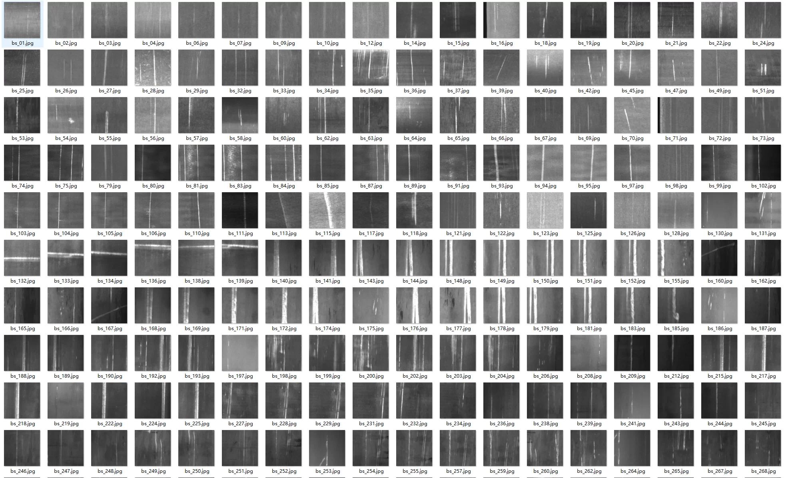
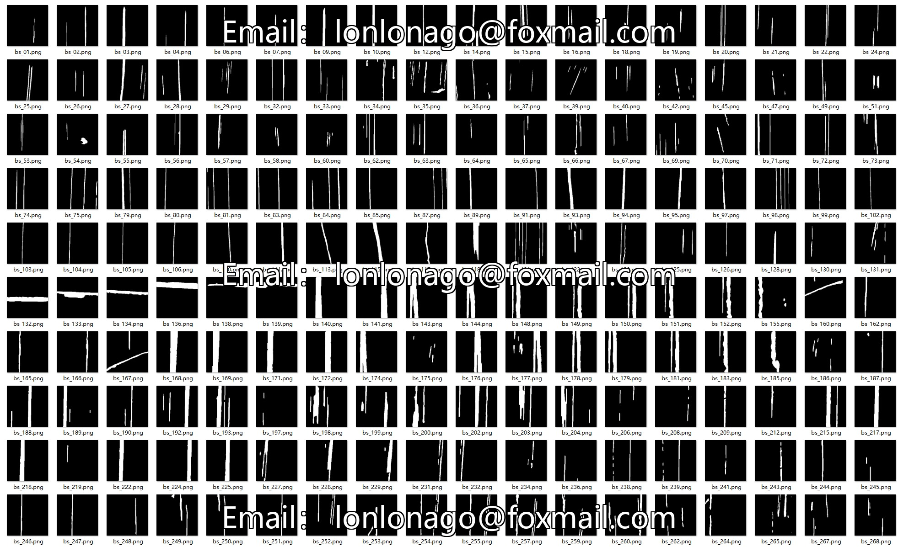
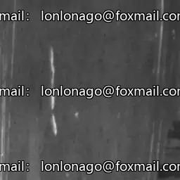
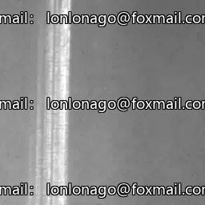
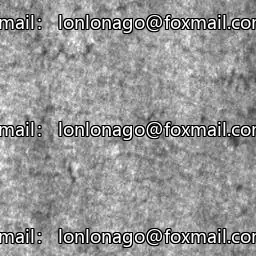
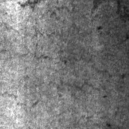

## Body

The dataset for steel surface defect detection segmentation consists of a total of 5454 images, with labeled training and validation sets. The training set includes 5454 images, while the validation set includes 2324 images.

The directory structure is as follows:
├── train/
├── train_mask/
├── val/
└── val_mask/

## Images

item_1052441366588

Here is a pay link on Stripe ( https://buy.stripe.com/3cs8yP7sY87d0vu9AB ). Please contact me lonlonago@foxmail.com after funding $89, and I will send you a complete data files , thank you!

